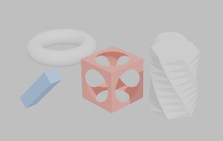
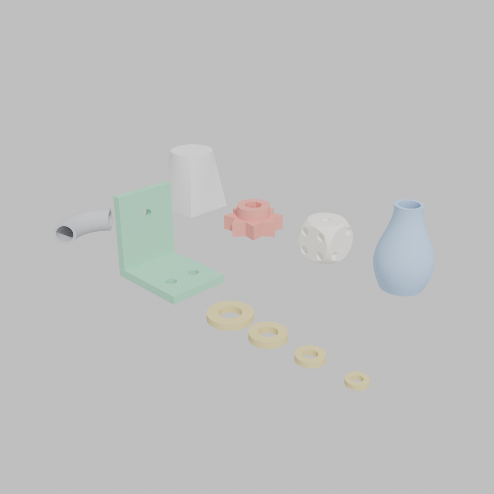

# suzanne

3d solid modeling and CAD in Clojure, rendered by Blender. Named for [Blender's monkey mascot](https://en.wikipedia.org/wiki/Blender_(software)#Suzanne).

suzanne gives you the OpenSCAD / [scad-clj](https://github.com/farrellm/scad-clj) experience (pure data, REPL-driven, composable CSG) with Blender as the geometry engine instead of OpenSCAD. Shapes are plain Clojure maps; nothing touches Blender until you build. Blender runs in-process as a Python module (via [libpython-clj](https://github.com/clj-python/libpython-clj) and the official [bpy wheel](https://pypi.org/project/bpy/)), so there is no external renderer subprocess and no `.scad` intermediate files.

```clojure
(require '[suzanne.core :as s])

(s/preview!
  (s/difference
    (s/cube 30)
    (s/sphere 19)
    (s/cylinder 8 40)))
```



## Why Blender instead of OpenSCAD?

Everything OpenSCAD's CSG can do, plus the things it can't: importing and operating on scanned meshes, voxel remeshing, offset surfaces, geometry nodes, subdivision, and a real interactive viewport. And because the engine is in-process, you can drop below the DSL at any time and drive any part of `bpy` directly from Clojure.

## Requirements

- **Python 3.11** with the bpy wheel (Blender 4.5 LTS as a Python module). `scripts/setup-bpy-venv.sh` creates the venv; the wheel is about 300 MB.
- **A JVM matching bpy's architecture.** On Apple silicon this must be an arm64 JDK. An Intel JDK under Rosetta cannot load bpy and is the most common setup mistake (`brew install openjdk`, then `JAVA_HOME=/opt/homebrew/opt/openjdk`, or `:java-cmd` in Leiningen).
- Blender itself is only needed for the optional live viewport; headless modeling and export need nothing but the wheel.
- Developed on macOS (arm64). Linux should work in principle (the libpython lookup handles `.so`) but is untested; reports welcome.

## Setup

```bash
git clone https://github.com/bdevel/suzanne
cd suzanne
./scripts/setup-bpy-venv.sh   # creates ./bpy-venv with bpy 4.5.3
clojure -M:smoke              # optional: verify everything works
```

As a git dependency in your own project's `deps.edn`:

```clojure
{:deps {io.github.bdevel/suzanne {:git/url "https://github.com/bdevel/suzanne"
                                    :git/sha "..."}}}
```

Then tell suzanne where the venv python lives, either with the `SUZANNE_PYTHON` environment variable or by binding `suzanne.core/*python-executable*` before the first call.

## The REPL loop

Two preview modes, from cheap to luxurious:

**`preview!`** exports an STL and opens it in the OS viewer. On macOS, Preview.app gives you a rotatable 3D view. Zero setup, but no colors.

**`live-view!`** pushes each build into a real Blender GUI viewport. Start the viewer once, then every eval updates the geometry in place while your camera orbit stays put:

```clojure
(s/start-live-viewer!)   ;; opens Blender with a localhost listener

(s/live-view!
  (s/color [0.85 0.3 0.25 1.0]
    (s/difference (s/cube 30) (s/sphere 19))))
;; edit, re-eval, watch it change
```

The viewer is a ~150 line listener (`resources/suzanne/live_addon.py`) that receives one-line JSON commands over `127.0.0.1:4777` and loads GLB files into a dedicated collection on Blender's main thread. `SUZANNE_LIVE_PORT` overrides the port.

## API

| OpenSCAD | suzanne |
|---|---|
| `sphere(r)` | `(sphere r)` |
| `cube([x,y,z], center)` | `(cube x y z)`, `(cube s)` |
| `cylinder(h, r/r1, r2)` | `(cylinder r h)`, `(cylinder [r1 r2] h)` |
| `polyhedron(points, faces)` | `(polyhedron points faces)` |
| `circle(r)` | `(circle r)` |
| `square([w,h], center)` | `(square w h)`, `(square s)` |
| `polygon(points)` | `(polygon points)` |
| `linear_extrude(h, twist, ...)` | `(linear-extrude {:height h :twist deg} outline)` |
| `rotate_extrude(angle)` | `(rotate-extrude {:angle deg} outline)` |
| `import("f.stl")` | `(import-model "f.stl")` (.stl, .obj) |
| `translate([x,y,z])` | `(translate [x y z] & shapes)` |
| `rotate([x,y,z])` / `rotate(a, v)` | `(rotate [rx ry rz] & shapes)`, `(rotate a [x y z] & shapes)` |
| `scale([x,y,z])` | `(scale v & shapes)` |
| `mirror([x,y,z])` | `(mirror n & shapes)` |
| `union / difference / intersection` | `(union ...)`, `(difference ...)`, `(intersection ...)` |
| `color(c)` | `(color [r g b a] & shapes)` |
| `*` disable | `(disable & shapes)` |
| `!` show only | `(show-only & shapes)` |
| `#` highlight | `(highlight & shapes)` |
| `$fn` | `*segments*` / `(with-segments n ...)` |

Semantics follow **scad-clj**, not raw OpenSCAD: primitives are centered by default, `rotate` takes radians, and `:twist`/`:angle` are degrees. If you have scad-clj code, it ports almost mechanically.

Realization and output:

- `(build! shape)` — realize a shape (or seq of shapes) in the scene, returns the Blender object(s)
- `(preview! shape)` / `(live-view! shape)` — the REPL loops described above
- `(export-stl! obj path)`, `(export-glb! path)`, `(save-blend! path)`
- `(mesh-stats obj)` — vert/face counts and a watertightness check
- `(render-preview! path)` — Cycles PNG render with an auto-framed camera

A lower-level sweep tool, `loft-mesh`, bridges any sequence of cross-section rings into a solid, for shapes that would need hull gymnastics in OpenSCAD.

And when the DSL runs out, `(bpy)` hands you the live `bpy` module and the full Blender API via libpython-clj.

## Examples

[examples/showcase.clj](examples/showcase.clj) is a guided tour focused on composition: shapes are plain data, so `let`, `for`, `map`, and `apply` are the modeling tools. It builds a die (data-driven pip cutters spliced with `apply difference`), a vase (a revolve profile computed with math), a star knob (reusable outline functions and the cutter-overshoot trick), a pipe elbow (partial revolves), an L-bracket (named dimensions, cross-axis holes), a family of washers (a part as a function, laid out with `map-indexed`), and a lofted square-to-round duct (the below-the-DSL `loft-mesh`), then arranges everything into one scene:



```clojure
(load-file "examples/showcase.clj")
(in-ns 'examples.showcase)
(s/preview! gallery)     ;; or (s/live-view! gallery)
```

## Caveats

- Blender's C++ teardown can segfault **at JVM exit**, after all work is complete. Exports are unaffected and a long-lived REPL never sees it, but batch scripts should verify outputs rather than trust exit codes.
- bpy in module mode is headless; the GUI in `live-view!` is a separate Blender process fed over a socket.
- Booleans use Blender's EXACT solver: robust, but slower than OpenSCAD's preview (F5) mode on big unions.
- Not yet implemented: `text`, `projection`, `surface`, `resize`, `minkowski`, `hull`, polygon holes, and the `%` background modifier.

## Prior art

- [scad-clj](https://github.com/farrellm/scad-clj) — the DSL this imitates
- [blender-clj](https://github.com/tristanstraub/blender-clj) — proved Clojure could drive Blender in-process, back when bpy had to be compiled by hand
- [libpython-clj](https://github.com/clj-python/libpython-clj) — the bridge that makes it all work

## License

MIT. See [LICENSE](LICENSE).
